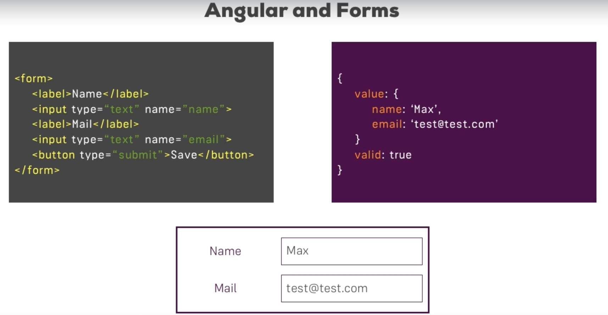
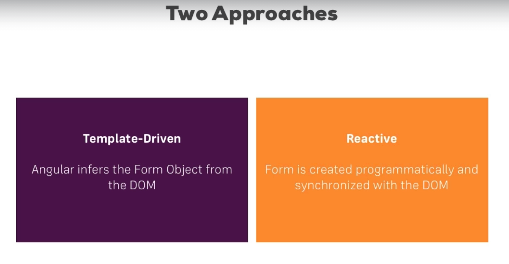
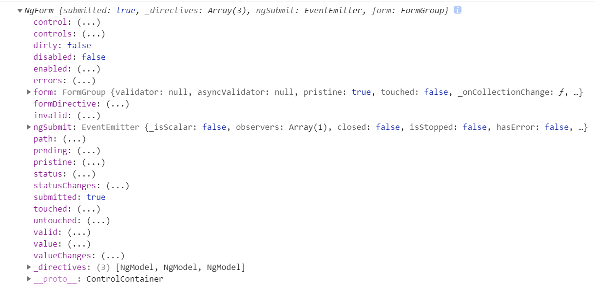

## Template-Driven Form

### 兩種 Form 的比較



這是 Udemy 課程截下來的圖片，所表示的是個簡單的 Form 表單，單按下送出按鈕後會有一組右邊 JSON 格式的資料送到後端，Angular 的 Form 比起簡單的 Form 多了一層封裝，除了 input tag 內部的資料外，還有檢核的狀態，或是錯誤的類型......，也因為多了這層封裝，並不會有預設的 Form 表單行為 ( 在 `<form>` 中按下 `<button>` 會出現導頁或重整的行為 )。在封裝 Form 表單上， Angular 提供了兩種類型的 Form :



一種是 Template-Driven Form，它主要是將驗證的部分寫在 Template 上，通常用於相對起來比較簡單的驗證，另一種是 Reactive Form，它會把驗證的部分寫在邏輯 TypeScript 上，相對起來可以來做比較複雜的驗證。

### `ngModel`、`ngForm`

可以先看看最原先的檔案，稍微觀察一下並將其改成以下的形式 :

``` 
|--app
    |--app.component.html // 更動
    |--app.component.ts // 更動
```

``` html
<div class="container">
  <div class="row">
    <div class="col-xs-12 col-sm-10 col-md-8 col-sm-offset-1 col-md-offset-2">
      <form (ngSubmit)="onSubmit(form)" #form="ngForm">
        <div id="user-data">
          <div class="form-group">
            <label for="username">Username</label>
            <input type="text"
                    id="username"
                    class="form-control"
                    name="username"
                    ngModel>
          </div>
          <button class="btn btn-default" type="button">Suggest an Username</button>
          <div class="form-group">
            <label for="email">Mail</label>
            <input type="email"
                    id="email"
                    class="form-control"
                    name="email"
                    ngModel>
          </div>
        </div>
        <div class="form-group">
          <label for="secret">Secret Questions</label>
          <select id="secret"
                  class="form-control"
                  name="secret"
                  ngModel>
            <option value="pet">Your first Pet?</option>
            <option value="teacher">Your first teacher?</option>
          </select>
        </div>
        <button class="btn btn-primary" type="submit">Submit</button>
      </form>
    </div>
  </div>
</div>
```

``` TypeScript
export class AppComponent {
  suggestUserName() {
    const suggestedName = 'Superuser';
  }

  onSubmit(form: NgForm) {
    console.log(form);
    console.log('submitted!');
  }
}
```

改動的地方在於每個 `<input>` 都補上 `ngModel` 的 Directive，這是 Angular 用來標記它是需要被 Template-Driven Form 管理的做法，並且替每個 `<input>` 加上 name 屬性，name 屬性並不是 Angular 特有的做法，在原先的 html 中要傳資料送到後端本來就需要補上 name 屬性。`<form>` 上面補上 `ngForm` 屬性來讓它被 Template-Driven Form 管理，並且使用範本參考變數將 `ngForm` 帶到邏輯層 TypeScript 中，然後使用 `console.log(..)` 進行觀察。

這邊可能有個困惑點是，為什麼不是放在 `<button>` 直接綁定 click Event，而要特別放在 `<form>` 上面，原因跟前面的相同 Angular 對 Form 多了一層封裝，也就多了 ngSubmit 事件可以使用，因此直接利用這樣的屬性即可。

### Form 表單狀態



當看到 `ngForm` 以後，裡面帶有相當多的資訊，先解釋其中三個常使用的狀態，`dirty`、`touched`、`valid`，這三種狀態在做 UI 畫面時很常使用到，先看看他們分別代表的意思 :

|控制狀態選項|CSS類別|反向CSS類別
|---|---|---|
|Visted|ng-touched|ng-untouched|
|Changed|ng-dirty|ng-pristine|
|Valid|ng-valid|ng-invalid|

`touched` 代表 Form 表單的 `ngModel` 是否已經有被觸碰過，`dirty` 代表 Form 表單的 `ngModel` 是否有被更改過，而 `valid` 則是有沒有通過驗證，如果用開發人員工具點開這些元素，應該會看到幾個額外加上去的類別，而這些類別跟這幾個驗證狀態可以說是互相照應。而除了 `ngForm`，每個 `ngModel` 其實也各自有自己的這些屬性，如果點開發人員工具的 `control` 屬性，會發現自己在 `<input>` 上有加上 `ngModel` 的標籤。

### 改用 `@ViewChild()` 來監控 `ngForm`

跟前面相同範本參考變數除了直接使用 Event Binding 將其傳到 TypeScript
，另一個做法是使用 `@ViewChild` 來進行監控 :

``` 
|--app
    |--app.component.html // 更動
    |--app.component.ts // 更動
```

```html
<div class="container">
  <div class="row">
    <div class="col-xs-12 col-sm-10 col-md-8 col-sm-offset-1 col-md-offset-2">
      <form (ngSubmit)="onSubmit()" #form="ngForm">
        <div id="user-data">
          <div class="form-group">
            <label for="username">Username</label>
            <input type="text"
                    id="username"
                    class="form-control"
                    name="username"
                    ngModel>
          </div>
          <button class="btn btn-default" type="button">Suggest an Username</button>
          <div class="form-group">
            <label for="email">Mail</label>
            <input type="email"
                    id="email"
                    class="form-control"
                    name="email"
                    ngModel>
          </div>
        </div>
        <div class="form-group">
          <label for="secret">Secret Questions</label>
          <select id="secret"
                  class="form-control"
                  name="secret"
                  ngModel>
            <option value="pet">Your first Pet?</option>
            <option value="teacher">Your first teacher?</option>
          </select>
        </div>
        <button class="btn btn-primary" type="submit">Submit</button>
      </form>
    </div>
  </div>
</div>
```

``` TypeScript
export class AppComponent {
  @ViewChild('form', {static: false}) signupForm: NgForm;

  suggestUserName() {
    const suggestedName = 'Superuser';
  }

  onSubmit() {
    console.log(this.signupForm);
  }
}
```

為了觀察這些狀態，加上一些 html 原生的基本驗證功能，`required` 以及 `email` :

``` 
|--app
    |--app.component.html // 更動
```

``` html
<div class="container">
  <div class="row">
    <div class="col-xs-12 col-sm-10 col-md-8 col-sm-offset-1 col-md-offset-2">
      <form (ngSubmit)="onSubmit()" #form="ngForm">
        <div id="user-data">
          <div class="form-group">
            <label for="username">Username</label>
            <input type="text"
                    id="username"
                    class="form-control"
                    name="username"
                    ngModel
                    required>
          </div>
          <button class="btn btn-default" type="button">Suggest an Username</button>
          <div class="form-group">
            <label for="email">Mail</label>
            <input type="email"
                    id="email"
                    class="form-control"
                    name="email"
                    ngModel
                    required
                    email>
          </div>
        </div>
        <div class="form-group">
          <label for="secret">Secret Questions</label>
          <select id="secret"
                  class="form-control"
                  name="secret"
                  ngModel>
            <option value="pet">Your first Pet?</option>
            <option value="teacher">Your first teacher?</option>
          </select>
        </div>
        <button class="btn btn-primary" type="submit">Submit</button>
      </form>
    </div>
  </div>
</div>
```

除了這些外，能使用的基本驗證可以看看以下的連結 :

> https://angular.io/api/forms/Validators

### 呈現錯誤訊息

```
|--app
    |--app.component.html // 更動
```

``` html
<div class="container">
  <div class="row">
    <div class="col-xs-12 col-sm-10 col-md-8 col-sm-offset-1 col-md-offset-2">
      <form (ngSubmit)="onSubmit()" #form="ngForm">
        <div id="user-data">
          <div class="form-group">
            <label for="username">Username</label>
            <input type="text"
                    id="username"
                    class="form-control"
                    name="username"
                    ngModel
                    required>
          </div>
          <button class="btn btn-default" type="button">Suggest an Username</button>
          <div class="form-group">
            <label for="email">Mail</label>
            <input type="email"
                    id="email"
                    class="form-control"
                    name="email"
                    ngModel
                    required
                    email
                    #email="ngModel">
            <span class="help-block" *ngIf="email.invalid && email.touched">Please enter a valid email!</span>
          </div>
        </div>
        <div class="form-group">
          <label for="secret">Secret Questions</label>
          <select id="secret"
                  class="form-control"
                  name="secret"
                  ngModel>
            <option value="pet">Your first Pet?</option>
            <option value="teacher">Your first teacher?</option>
          </select>
        </div>
        <button class="btn btn-primary" type="submit" [disabled]="form.invalid">Submit</button>
      </form>
    </div>
  </div>
</div>
```

這邊主要利用範本參考變數決定 UI 的呈現，第一個可以先看到 `<button>` 上面的 `[disabled]` 綁定到 `ngForm` 上面，此時只要整個 form 表單驗證沒有通過，按鈕就會呈現 disable，另一個是在 `<input>` 底下新增一個 `<span>`，它則是錯誤訊息的呈現，可以看到 `<span>` 的 `*ngIf` 是綁定到 `ngModel` 上面，只要 `ngModel` 為 `invalid` 就呈現錯誤訊息。

### 使用 `ngModel` 進行綁定

另外可以使用 `ngModel` 將 `<input>` 的值綁定到邏輯層 TypeScript :

```
|--app
    |--app.component.html // 更動
    |--app.componrnt.ts // 更動
```

``` html
<div class="container">
  <div class="row">
    <div class="col-xs-12 col-sm-10 col-md-8 col-sm-offset-1 col-md-offset-2">
      <form (ngSubmit)="onSubmit()" #form="ngForm">
        <div id="user-data">
          <div class="form-group">
            <label for="username">Username</label>
            <input type="text"
                    id="username"
                    class="form-control"
                    name="username"
                    ngModel
                    required>
          </div>
          <button class="btn btn-default" type="button">Suggest an Username</button>
          <div class="form-group">
            <label for="email">Mail</label>
            <input type="email"
                    id="email"
                    class="form-control"
                    name="email"
                    ngModel
                    required
                    email
                    #email="ngModel">
            <span class="help-block" *ngIf="email.invalid && email.touched">Please enter a valid email!</span>
          </div>
        </div>
        <div class="form-group">
          <label for="secret">Secret Questions</label>
          <select id="secret"
                  class="form-control"
                  name="secret"
                  [ngModel]="defaultQuestion">
            <option value="pet">Your first Pet?</option>
            <option value="teacher">Your first teacher?</option>
          </select>
        </div>
        <div class="form-group">
          <textarea name="testTextarea"
                    rows="3"
                    class="form-control"
                    [(ngModel)]="answer">
          </textarea>
        </div>
        <p>Your reply:{{answer}}</p>
        <button class="btn btn-primary" type="submit" [disabled]="form.invalid">Submit</button>
      </form>
    </div>
  </div>
</div>
```

``` TypeScript
export class AppComponent {
  @ViewChild('form', {static: false}) signupForm: NgForm;
  defaultQuestion = 'teacher';
  answer = 'answer';

  suggestUserName() {
    const suggestedName = 'Superuser';
  }

  onSubmit() {
    console.log(this.signupForm);
  }
}
```

這邊分別有兩種綁定方式，一種是 `<textarea>` 中使用 `[(ngModel)]` 的雙向綁定，一種則是在 `<input>` 使用 `[ngModel]` 的 Property Binding 把 TypeScript 的值綁到 Template 上，只是一個是雙向一個是單向，而這兩個也都具有驗證上的功能。

### `ngModelGroup`

```
|--app
    |--app.component.html // 更動
    |--app.componrnt.ts // 更動
```

``` html
<div class="container">
  <div class="row">
    <div class="col-xs-12 col-sm-10 col-md-8 col-sm-offset-1 col-md-offset-2">
      <form (ngSubmit)="onSubmit()" #form="ngForm">
        <div id="user-data"
              ngModelGroup="userData"
              #userData="ngModelGroup">
          <div class="form-group">
            <label for="username">Username</label>
            <input type="text"
                    id="username"
                    class="form-control"
                    name="username"
                    ngModel
                    required>
          </div>
          <button class="btn btn-default" type="button">Suggest an Username</button>
          <div class="form-group">
            <label for="email">Mail</label>
            <input type="email"
                    id="email"
                    class="form-control"
                    name="email"
                    ngModel
                    required
                    email
                    #email="ngModel">
            <span class="help-block" *ngIf="email.invalid && email.touched">Please enter a valid email!</span>
          </div>
        </div>
        <p *ngIf="userData.invalid && userData.touched">User Data is invalid!</p>
        <div class="form-group">
          <label for="secret">Secret Questions</label>
          <select id="secret"
                  class="form-control"
                  name="secret"
                  [ngModel]="defaultQuestion">
            <option value="pet">Your first Pet?</option>
            <option value="teacher">Your first teacher?</option>
          </select>
        </div>
        <div class="form-group">
          <textarea name="testTextarea"
                    rows="3"
                    class="form-control"
                    [(ngModel)]="answer">
          </textarea>
        </div>
        <p>Your reply:{{answer}}</p>
        <button class="btn btn-primary" type="submit" [disabled]="form.invalid">Submit</button>
      </form>
    </div>
  </div>
</div>
```

另一種做法除了讓整個 Form 表單變成整個群集外，還可以額外使用 `ngModelGroup` 來分別 group 想要群集的區塊，並且使用的方式一樣，利用範本參考變數來綁定 `ngModelGroup` 的東西到各個地方，這樣便可以決定是否要顯示某些錯誤訊息。

### radio 綁定

在 TypeScript 中加入 genders 陣列，並使用 `*ngFor` 把值迭代出來，而上面都必須要加上 `ngModel` 以及 name 屬性 :

```
|--app
    |--app.component.html // 更動
    |--app.componrnt.ts // 更動
```

``` html
<div class="container">
  <div class="row">
    <div class="col-xs-12 col-sm-10 col-md-8 col-sm-offset-1 col-md-offset-2">
      <form (ngSubmit)="onSubmit()" #form="ngForm">
        <div id="user-data"
              ngModelGroup="userData"
              #userData="ngModelGroup">
          <div class="form-group">
            <label for="username">Username</label>
            <input type="text"
                    id="username"
                    class="form-control"
                    name="username"
                    ngModel
                    required>
          </div>
          <button class="btn btn-default" type="button">Suggest an Username</button>
          <div class="form-group">
            <label for="email">Mail</label>
            <input type="email"
                    id="email"
                    class="form-control"
                    name="email"
                    ngModel
                    required
                    email
                    #email="ngModel">
            <span class="help-block" *ngIf="email.invalid && email.touched">Please enter a valid email!</span>
          </div>
        </div>
        <p *ngIf="userData.invalid && userData.touched">User Data is invalid!</p>
        <div class="form-group">
          <label for="secret">Secret Questions</label>
          <select id="secret"
                  class="form-control"
                  name="secret"
                  [ngModel]="defaultQuestion">
            <option value="pet">Your first Pet?</option>
            <option value="teacher">Your first teacher?</option>
          </select>
        </div>
        <div class="form-group">
          <textarea name="testTextarea"
                    rows="3"
                    class="form-control"
                    [(ngModel)]="answer">
          </textarea>
        </div>
        <p>Your reply:{{answer}}</p>
        <div class="radio" *ngFor="let gender of genders">
          <label>
            <input type="radio"
                    name="gender"
                    ngModel
                    [value]="gender"
                    required>
          </label>
        </div>
        <button class="btn btn-primary" type="submit" [disabled]="form.invalid">Submit</button>
      </form>
    </div>
  </div>
</div>
```

``` TypeScript
export class AppComponent {
  @ViewChild('form', {static: false}) signupForm: NgForm;
  defaultQuestion = 'teacher';
  answer = 'answer';
  genders = ['male', 'female'];

  suggestUserName() {
    const suggestedName = 'Superuser';
  }

  onSubmit() {
    console.log(this.signupForm);
  }
}
```

### `setValue` && `patchValue`

在某些情境之下，可能會按下按鈕後給予各個 `<input>`、`<textarea>`、`<select>` 預設值，此時在 TypeScript 中可以使用 `setValue(..)` 跟 `patchValue(..)` :

```
|--app
    |--app.component.html // 更動
    |--app.componrnt.ts // 更動
```

``` html
<div class="container">
  <div class="row">
    <div class="col-xs-12 col-sm-10 col-md-8 col-sm-offset-1 col-md-offset-2">
      <form (ngSubmit)="onSubmit()" #form="ngForm">
        <div id="user-data"
              ngModelGroup="userData"
              #userData="ngModelGroup">
          <div class="form-group">
            <label for="username">Username</label>
            <input type="text"
                    id="username"
                    class="form-control"
                    name="username"
                    ngModel
                    required>
          </div>
          <button class="btn btn-default"
                    type="button"
                    (click)="suggestUserName()">Suggest an Username</button>
          <div class="form-group">
            <label for="email">Mail</label>
            <input type="email"
                    id="email"
                    class="form-control"
                    name="email"
                    ngModel
                    required
                    email
                    #email="ngModel">
            <span class="help-block" *ngIf="email.invalid && email.touched">Please enter a valid email!</span>
          </div>
        </div>
        <p *ngIf="userData.invalid && userData.touched">User Data is invalid!</p>
        <div class="form-group">
          <label for="secret">Secret Questions</label>
          <select id="secret"
                  class="form-control"
                  name="secret"
                  [ngModel]="defaultQuestion">
            <option value="pet">Your first Pet?</option>
            <option value="teacher">Your first teacher?</option>
          </select>
        </div>
        <div class="form-group">
          <textarea name="questionAnswer"
                    rows="3"
                    class="form-control"
                    [(ngModel)]="answer">
          </textarea>
        </div>
        <p>Your reply:{{answer}}</p>
        <div class="radio" *ngFor="let gender of genders">
          <label>
            <input type="radio"
                    name="gender"
                    ngModel
                    [value]="gender"
                    required>
          </label>
        </div>
        <button class="btn btn-primary" type="submit" [disabled]="form.invalid">Submit</button>
      </form>
    </div>
  </div>
</div>
```

``` TypeScript
export class AppComponent {
  @ViewChild('form', {static: false}) signupForm: NgForm;
  defaultQuestion = 'teacher';
  answer = 'answer';
  genders = ['male', 'female'];

  suggestUserName() {
    const suggestedName = 'Superuser';
    this.signupForm.setValue({
      userData: {
        username: suggestedName,
        email: ''
      },
      secret: 'pet',
      questionAnswer: '',
      gender: 'male'
    });
  }

  onSubmit() {
    console.log(this.signupForm);
  }
}
```

兩者的差別在於 `setValue(..)` 會直接將原本在上面的值給覆蓋掉，而且全部的值都必須要給，`patchValue(..)` 則像是種補丁，可以選擇性的給值 ( 也因此通常會使用 `patchValue(..)` )。

### 使用 Form 表單中的資料 && 重設表單

最後則是使用取得 Form 表單中裡面的資料，資料放在 `NgForm` 中的 `value` 屬性，而如果想要清除表單內容則再使用 `reset(..)` 來清除表單內的東西，另外還能夠將表單的狀態還回原狀。

```
|--app
    |--app.component.html // 更動
    |--app.componrnt.ts // 更動
```

``` html
<div class="container">
  <div class="row">
    <div class="col-xs-12 col-sm-10 col-md-8 col-sm-offset-1 col-md-offset-2">
      <form (ngSubmit)="onSubmit()" #form="ngForm">
        <div id="user-data"
              ngModelGroup="userData"
              #userData="ngModelGroup">
          <div class="form-group">
            <label for="username">Username</label>
            <input type="text"
                    id="username"
                    class="form-control"
                    name="username"
                    ngModel
                    required>
          </div>
          <button class="btn btn-default"
                    type="button"
                    (click)="suggestUserName()">Suggest an Username</button>
          <div class="form-group">
            <label for="email">Mail</label>
            <input type="email"
                    id="email"
                    class="form-control"
                    name="email"
                    ngModel
                    required
                    email
                    #email="ngModel">
            <span class="help-block" *ngIf="email.invalid && email.touched">Please enter a valid email!</span>
          </div>
        </div>
        <p *ngIf="userData.invalid && userData.touched">User Data is invalid!</p>
        <div class="form-group">
          <label for="secret">Secret Questions</label>
          <select id="secret"
                  class="form-control"
                  name="secret"
                  [ngModel]="defaultQuestion">
            <option value="pet">Your first Pet?</option>
            <option value="teacher">Your first teacher?</option>
          </select>
        </div>
        <div class="form-group">
          <textarea name="questionAnswer"
                    rows="3"
                    class="form-control"
                    [(ngModel)]="answer">
          </textarea>
        </div>
        <p>Your reply:{{answer}}</p>
        <div class="radio" *ngFor="let gender of genders">
          <label>
            <input type="radio"
                    name="gender"
                    ngModel
                    [value]="gender"
                    required>
          </label>
        </div>
        <button class="btn btn-primary" type="submit" [disabled]="form.invalid">Submit</button>
      </form>
    </div>
  </div>
  <hr>
  <div class="row" *ngIf="submitted">
    <div class="col-xs-12">
      <h3>Your Data</h3>
      <p>Username:{{user.userName}}</p>
      <p>Mail:{{user.mail}}</p>
      <p>Secret Question:{{user.secretQuestion}}</p>
      <p>Answer:{{user.answer}}</p>
      <p>Gender:{{user.gender}}</p>
    </div>
  </div>
</div>
```

``` TypeScript
export class AppComponent {
  @ViewChild('form', {static: false}) signupForm: NgForm;
  defaultQuestion = 'teacher';
  answer = 'answer';
  genders = ['male', 'female'];
  submitted = false;
  user = {
    userName: '',
    mail: '',
    secretQuestion: '',
    answer: '',
    secret: '',
    gender: ''
  };

  suggestUserName() {
    const suggestedName = 'Superuser';
    this.signupForm.setValue({
      userData: {
        username: suggestedName,
        email: ''
      },
      secret: 'pet',
      questionAnswer: '',
      gender: 'male'
    });
  }

  onSubmit() {
    console.log(this.signupForm);
    this.submitted = true;
    this.user.gender = this.signupForm.value.gender;
    this.user.mail = this.signupForm.value.userData.email;
    this.user.userName = this.signupForm.value.userData.userName;
    this.user.secret = this.signupForm.value.secret;
    this.user.answer = this.signupForm.value.answer;

    this.signupForm.reset();
  }
}
```

### 總結

* `ngModel`、`ngModelGroup`、`ngForm`、`ngSubmit`
* `ng-valid`、`ng-invalid`、`ng-untouched`、`ng-touched`、`ng-pristine`、`ng-dirty`
* 動態呈現錯誤訊息
* `setValue(..)`、`patchValue(..)`、`reset(..)`
* 表格整理 :

NgModel :
|屬性名稱|型別|用途說明|
|---|---|---|
|name|string|欄位名稱|
|value|any|欄位值|
|valid|boolean|有效欄位(通過欄位驗證)|
|invalid|boolean|無效欄位(欄位驗證失敗)|
|errors|{[key: string]: any}|當出現無效欄位時，會出現錯誤狀態|
|dirty|boolean|欄位值是否曾經更動過一次|
|pristine|boolean|欄位值是否為原始值 ( 位曾被修改過 )|
|touched|boolean|欄位曾經經歷過 focus 事件|
|untouched|boolean|欄位從未經歷過 focus 事件|
|disabled|boolean|欄位設定為 disabled 狀態|
|enabled|boolean|欄位設定為 enabled 狀態|
|formDirective|NgForm|取得目前欄位所屬的 NgForm 表單物件|
|valueChanges|EventEmitter|可用來訂閱欄位值便更的事件|
|statusChanges|EventEmitter|可用來訂閱欄位狀態便更的事件|

NgModelGroup :
|屬性名稱|型別|用途說明|
|---|---|---|
|value|any|欄位值|
|valid|boolean|有效欄位(通過欄位驗證)|
|invalid|boolean|無效欄位(欄位驗證失敗)|
|errors|有此屬性但無資料|有此屬性但無資料|
|dirty|boolean|欄位值是否曾經更動過一次|
|pristine|boolean|欄位值是否為原始值 ( 位曾被修改過 )|
|touched|boolean|欄位曾經經歷過 focus 事件|
|untouched|boolean|欄位從未經歷過 focus 事件|
|disabled|boolean|欄位設定為 disabled 狀態|
|enabled|boolean|欄位設定為 enabled 狀態|
|formDirective|NgForm|取得目前欄位所屬的 NgForm 表單物件|
|valueChanges|EventEmitter|可用來訂閱欄位值便更的事件|
|statusChanges|EventEmitter|可用來訂閱欄位狀態便更的事件|

NgForm :
|屬性名稱|型別|用途說明|
|---|---|---|
|value|any|欄位值|
|valid|boolean|有效欄位(通過欄位驗證)|
|invalid|boolean|無效欄位(欄位驗證失敗)|
|errors|有此屬性但無資料|有此屬性但無資料|
|dirty|boolean|欄位值是否曾經更動過一次|
|pristine|boolean|欄位值是否為原始值 ( 位曾被修改過 )|
|touched|boolean|欄位曾經經歷過 focus 事件|
|untouched|boolean|欄位從未經歷過 focus 事件|
|disabled|boolean|欄位設定為 disabled 狀態|
|enabled|boolean|欄位設定為 enabled 狀態|
|valueChanges|EventEmitter|可用來訂閱欄位值便更的事件|
|statusChanges|EventEmitter|可用來訂閱欄位狀態便更的事件|
|submitted|boolean|判斷表單是否經歷過 ngSubmit 事件|