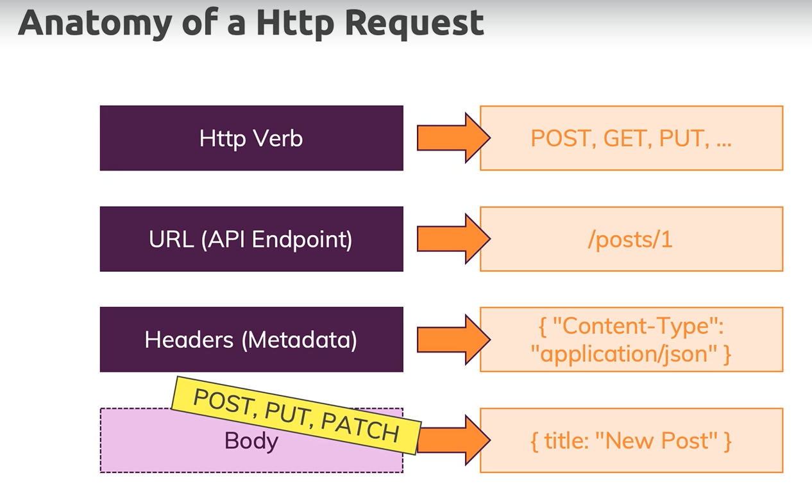
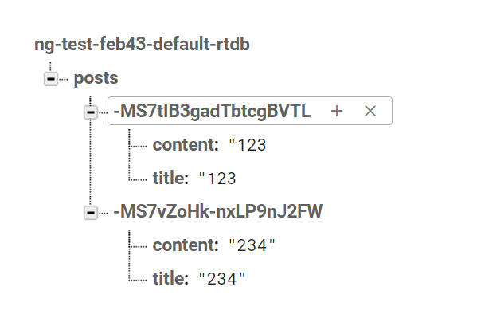

## Http Request

### 簡介 Http Request


這是 Udemy 上截來的圖片，多數時候會從後端取得資料，而因為 Angular 是屬於前端的框架，也就是說所有的東西都會送到瀏覽器也就是客戶端，也因此取得資料不會直接去連 DB，這會有安全性問題，而是有 API 供我們使用，並由這個 API 取得後端 DB 資料。



這張圖解釋 Http Request 裡面會包含的內容，Http 是種通訊協定，我們利用這種通訊協定與 API 端進行資料的交換，這個通訊基本上有幾個必須帶有的東西，第一個會是 Request 的動作 ( 可能是 GET、POST、DELETE...)，第二個 URL 是 API 的位址，第三個 Http Headers 是要解析此 Http Headers 需要的資訊 ( 像 Content-Type 是 json 就是解析 body 用 json 格式來解析 )，第四個 Body 則是發送 request 時內部會帶有的資料。

### 利用 FireBase 創建簡單的後端 API

FireBase 是 Google 提供的一個免費工具，我們利用它來當作簡單的後端 API，首先直接使用 Google 帳號來登入 :


進到 FireBase 後按下新增專案來新增新的 API，再來點進這個專案來看看內部配置的 URL :


點進去之後直接來看左邊的 Realtime Database，一開始點進來會問要使用鎖定模式還是測試模式，先直接選擇測試模式，再來應該就會進到上面的畫面。如果這些東西都配置完成後，就可以開始在程式碼中嘗試打 API。

### 發送 POST 請求

``` 
|--app
    |--app.component.html // 更動
    |--app.component.ts // 更動
    |--app.module.ts // 更動
```

``` html
<div class="container">
  <div class="row">
    <div class="col-xs-12 col-md-6 col-md-offset-3">
      <form #postForm="ngForm" (ngSubmit)="onCreatePost(postForm.value)">
        <div class="form-group">
          <label for="title">Title</label>
          <input
            type="text"
            class="form-control"
            id="title"
            required
            ngModel
            name="title"
          />
        </div>
        <div class="form-group">
          <label for="content">Content</label>
          <textarea
            class="form-control"
            id="content"
            required
            ngModel
            name="content"
          ></textarea>
        </div>
        <button
          class="btn btn-primary"
          type="submit"
          [disabled]="!postForm.valid"
        >
          Send Post
        </button>
      </form>
    </div>
  </div>
  <hr />
  <div class="row">
    <div class="col-xs-12 col-md-6 col-md-offset-3">
      <button class="btn btn-primary" (click)="onFetchPosts()">
        Fetch Posts
      </button>
      |
      <button
        class="btn btn-danger"
        [disabled]="loadedPosts.length < 1"
        (click)="onClearPosts()"
      >
        Clear Posts
      </button>
    </div>
  </div>
  <div class="row">
    <div class="col-xs-12 col-md-6 col-md-offset-3">
      <p>No posts available!</p>
    </div>
  </div>
</div>
```

``` TypeScript
@NgModule({
  declarations: [AppComponent],
  imports: [BrowserModule, FormsModule, HttpClientModule],
  providers: [],
  bootstrap: [AppComponent]
})
export class AppModule {}
```

``` TypeScript
export class AppComponent implements OnInit {
  loadedPosts = [];

  constructor(private http: HttpClient) { }

  ngOnInit() { }

  onCreatePost(postData: { title: string; content: string }) {
    this.http
      .post(
        'your url here!!!',
        postData
      )
      .subscribe(responseData => {
        console.log(responseData);
      });
  }

  onFetchPosts() {
    // Send Http request
  }

  onClearPosts() {
    // Send Http request
  }
}
```

想要發送 Http Request 必須先在 `AppModule` 中 import `HttpClientModule`，import 後就可以在其他 Component 注入 `HttpClient`，並使用 `HttpClient` 來發送 GET、POST......等請求。這個 POST method 中帶有兩個參數，第一個參數是發送請求的 URL ( 直接貼上 FireBase 的 URL，並在後面補上 `posts.json`，這是屬於 FireBase 的設定，現階段不必過於糾結為何要加 `posts.json` )，第二個參數是要送到後端的 Json 資料，當我們發送請求後就會在 FireBase 這端拿到送過來的資料 :



在發送 POST 請求後會拿到 Observable 物件，必須對它進行 `subscribe(..)` 來進行操作，這邊先把資料印出來即可，這時前端可以拿到 POST 請求儲存資料成功而得到的回應。

### 發送 GET 請求

除了 POST 請求將值存到 FireBase 中，也可以使用 GET 請求將 FireBase 中的值給取出來 :

``` 
|--app
    |--app.component.ts // 更動
```

``` TypeScript
export class AppComponent implements OnInit {
  loadedPosts = [];

  constructor(private http: HttpClient) { }

  ngOnInit() {
    this.fetchPosts();
  }

  onCreatePost(postData: { title: string; content: string }) {
    this.http
      .post(
        'https://ng-test-feb43-default-rtdb.firebaseio.com/posts.json',
        postData
      )
      .subscribe(responseData => {
        console.log(responseData);
      });
  }

  onFetchPosts() {
    this.fetchPosts();
  }

  onClearPosts() {
    // Send Http request
  }

  private fetchPosts() {
    this.http.get('https://ng-test-feb43-default-rtdb.firebaseio.com/posts.json')
              .subscribe(console.log);
  }
}
```

這邊寫下一個 `private` 方法，這個方法的內容主要是用來發送 Http GET 請求用的，參數上只要傳入 URL 即可，並且使用 `subscribe` 進行訂閱。然後分別在 `ngOnInit` 以及 `onFetchPosts` 中呼叫此方法。

### 使用 `pipe(..)` 整理資料

有時從後端拿到的資料並不是我們所喜好的資料格式，這時可以使用 `pipe(..)` 對資料進行整理，這邊需要用到 rxjs 的 Operator :

``` 
|--app
    |--app.component.ts // 更動
```

``` TypeScript
export class AppComponent implements OnInit {
  loadedPosts = [];

  constructor(private http: HttpClient) { }

  ngOnInit() {
    this.fetchPosts();
  }

  onCreatePost(postData: { title: string; content: string }) {
    this.http
      .post(
        'https://ng-test-feb43-default-rtdb.firebaseio.com/posts.json',
        postData
      )
      .subscribe(responseData => {
        console.log(responseData);
      });
  }

  onFetchPosts() {
    this.fetchPosts();
  }

  onClearPosts() {
    // Send Http request
  }

  private fetchPosts() {
    this.http.get('https://ng-test-feb43-default-rtdb.firebaseio.com/posts.json')
              .pipe(map((responseData) => {
                const postArray = [];
                for(let key in responseData){
                  postArray.push({...responseData[key], id: key});
                }
                return postArray;
              }))
              .subscribe(console.log);
  }
}
```

主要改變的地方在於 `fetchPosts(..)` 內，在發送請求後使用 `pipe(..)` 對 Observable 進行操作，目前只先使用 `map(..)` 它所代表的意思是會對整個 Observable 的資料串流統一進行改動，我們對拿到的資料進行平展化，本來是一層的 JSON 結構，現在把第一層的 key 值改放在內部的 Object，而這邊的 `...` 的語法使用在物件上，表示將一個物件的內容迭代出來，並放到另一個物件中。

### 定義資料格式

``` 
|--app
    |--app.component.ts // 更動
    |--post.model.ts // 更動
```

``` TypeScript
export interface Post {
  title: string,
  content: string,
  id? : string
}
```

``` TypeScript
export class AppComponent implements OnInit {
  loadedPosts = [];

  constructor(private http: HttpClient) { }

  ngOnInit() {
    this.fetchPosts();
  }

  onCreatePost(postData: { title: string; content: string }) {
    this.http
      .post<{name: string}>(
        'https://ng-test-feb43-default-rtdb.firebaseio.com/posts.json',
        postData
      )
      .subscribe(responseData => {
        console.log(responseData);
      });
  }

  onFetchPosts() {
    this.fetchPosts();
  }

  onClearPosts() {
    // Send Http request
  }

  private fetchPosts() {
    this.http.get<{[key: string]: Post}>('https://ng-test-feb43-default-rtdb.firebaseio.com/posts.json')
              .pipe(map((responseData) => {
                const postArray: Post[] = [];
                for(let key in responseData){
                  postArray.push({...responseData[key], id: key});
                }
                return postArray;
              }))
              .subscribe(console.log);
  }
}
```

下一步嘗試在 Http 取得資料後，定義拿到的資料格式，首先定義出 `Post` interface 當做資料格式的 model，再來分別在 `get(..)` 及 `post(..)` 方法後面加上 `<..>` 定義內部會有的泛型。

### 呈現資料

``` 
|--app
    |--app.component.ts // 更動
    |--app.component.html // 更動
```

``` html
<div class="container">
  <div class="row">
    <div class="col-xs-12 col-md-6 col-md-offset-3">
      <form #postForm="ngForm" (ngSubmit)="onCreatePost(postForm.value)">
        <div class="form-group">
          <label for="title">Title</label>
          <input
            type="text"
            class="form-control"
            id="title"
            required
            ngModel
            name="title"
          />
        </div>
        <div class="form-group">
          <label for="content">Content</label>
          <textarea
            class="form-control"
            id="content"
            required
            ngModel
            name="content"
          ></textarea>
        </div>
        <button
          class="btn btn-primary"
          type="submit"
          [disabled]="!postForm.valid"
        >
          Send Post
        </button>
      </form>
    </div>
  </div>
  <hr />
  <div class="row">
    <div class="col-xs-12 col-md-6 col-md-offset-3">
      <button class="btn btn-primary" (click)="onFetchPosts()">
        Fetch Posts
      </button>
      |
      <button
        class="btn btn-danger"
        [disabled]="loadedPosts.length < 1"
        (click)="onClearPosts()"
      >
        Clear Posts
      </button>
    </div>
  </div>
  <div class="row">
    <div class="col-xs-12 col-md-6 col-md-offset-3">
      <p *ngIf="loadedPosts.length == 0">No posts available!</p>
      <ul class="list-group" *ngIf="loadedPosts.length > 0">
        <li class="list-group-item" *ngFor="let post of loadedPosts">
          <h3>{{ post.title }}</h3>
          <p>{{ post.content }}</p>s
        </li>
      </ul>
    </div>
  </div>
</div>
```

``` TypeScript
export class AppComponent implements OnInit {
  loadedPosts: Post[] = [];

  constructor(private http: HttpClient) { }

  ngOnInit() {
    this.fetchPosts();
  }

  onCreatePost(postData: { title: string; content: string }) {
    this.http
      .post<{ name: string }>(
        'https://ng-test-feb43-default-rtdb.firebaseio.com/posts.json',
        postData
      )
      .subscribe(responseData => {
        console.log(responseData);
      });
  }

  onFetchPosts() {
    this.fetchPosts();
  }

  onClearPosts() {
    // Send Http request
  }

  private fetchPosts() {
    this.http.get<{ [key: string]: Post }>('https://ng-test-feb43-default-rtdb.firebaseio.com/posts.json')
      .pipe(map((responseData) => {
        const postArray: Post[] = [];
        for (let key in responseData) {
          postArray.push({ ...responseData[key], id: key });
        }
        return postArray;
      }))
      .subscribe((data) => {
        console.log(data);
        this.loadedPosts = data;
      });
  }
}
```

再來下一個步驟，就是直接在前端畫面上呈現我們得到的資料，首先在 TypeScript 中的 `fetchPosts(..)` 內將陣列給替換掉，從原本的空陣列替換成從 FireBase 中取得的資料，接著在 Template 中使用 `*ngFor` 把值迭代到畫面上。

### 呈現 Loading 的字串

而因為非同步請求的原因，可以在 TypeScript 中加上一個 flag 來代表資料是否有完整的拿回來，讓畫面的呈現變得更加完整 :

``` 
|--app
    |--app.component.ts // 更動
    |--app.component.html // 更動
```

``` TypeScript
export class AppComponent implements OnInit {
  loadedPosts: Post[] = [];
  isFetching = false;

  constructor(private http: HttpClient) { }

  ngOnInit() {
    this.fetchPosts();
  }

  onCreatePost(postData: { title: string; content: string }) {
    this.http
      .post<{ name: string }>(
        'https://ng-test-feb43-default-rtdb.firebaseio.com/posts.json',
        postData
      )
      .subscribe(responseData => {
        console.log(responseData);
      });
  }

  onFetchPosts() {
    this.fetchPosts();
  }

  onClearPosts() {
    // Send Http request
  }

  private fetchPosts() {
    this.isFetching = true;
    this.http.get<{ [key: string]: Post }>('https://ng-test-feb43-default-rtdb.firebaseio.com/posts.json')
      .pipe(map((responseData) => {
        const postArray: Post[] = [];
        for (let key in responseData) {
          postArray.push({ ...responseData[key], id: key });
        }
        return postArray;
      }))
      .subscribe((data) => {
        this.isFetching = false;
        console.log(data);
        this.loadedPosts = data;
      });
  }
}
```

``` html
<div class="container">
  <div class="row">
    <div class="col-xs-12 col-md-6 col-md-offset-3">
      <form #postForm="ngForm" (ngSubmit)="onCreatePost(postForm.value)">
        <div class="form-group">
          <label for="title">Title</label>
          <input
            type="text"
            class="form-control"
            id="title"
            required
            ngModel
            name="title"
          />
        </div>
        <div class="form-group">
          <label for="content">Content</label>
          <textarea
            class="form-control"
            id="content"
            required
            ngModel
            name="content"
          ></textarea>
        </div>
        <button
          class="btn btn-primary"
          type="submit"
          [disabled]="!postForm.valid"
        >
          Send Post
        </button>
      </form>
    </div>
  </div>
  <hr />
  <div class="row">
    <div class="col-xs-12 col-md-6 col-md-offset-3">
      <button class="btn btn-primary" (click)="onFetchPosts()">
        Fetch Posts
      </button>
      |
      <button
        class="btn btn-danger"
        [disabled]="loadedPosts.length < 1"
        (click)="onClearPosts()"
      >
        Clear Posts
      </button>
    </div>
  </div>
  <div class="row">
    <div class="col-xs-12 col-md-6 col-md-offset-3">
      <p *ngIf="loadedPosts.length == 0 && !isFetching">No posts available!</p>
      <ul class="list-group" *ngIf="loadedPosts.length > 0 && !isFetching">
        <li class="list-group-item" *ngFor="let post of loadedPosts">
          <h3>{{ post.title }}</h3>
          <p>{{ post.content }}</p>
        </li>
      </ul>
      <p *ngIf="isFetching">Loading...</p>
    </div>
  </div>
</div>
```

這邊主要就是裡用這個 flag 來進行 `*ngIf` 的判斷，看畫面要不要顯示 Loading... 的字串。


