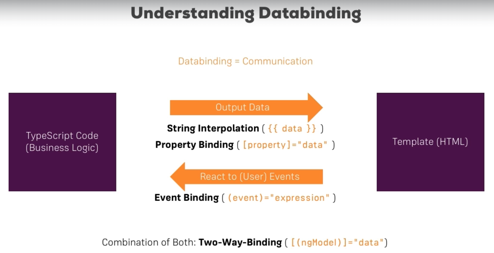

## Binding 



上面這張圖是從 Udemy 的課程截下來的內容，它簡單的講述了 Angular 的 Binding 究竟是如何運作的，對 Angular 來說，它將檔案切分成兩個部分，一個是邏輯的 TypeScript、另一個是呈現的 html，多數時候會從 TypeScript 發送請求，並且將拿到的資料表現在前端畫面上，這時可能會使用兩種 Binding 方式，一種是 String Interpolation ( 單純的將值送到 html 畫面上 )，一種是 Property Binding ( 設定 tag 的 property 值 )，而 user 與邏輯互動的部分則是依靠 Event Binding 來完成，最常見的就是按下按鈕後，要對資料做出更動。

最後則是結合兩者的 Two-Way-Binding，不論是畫面上的更新或是邏輯層的資料改變，兩者都會互相反應。

* String Interpolation
    ``` html
    <p>{{'server'}} with ID {{serverId}} is {{getServerStatus()}}</p>
    ```

    ``` TypeScript
    export class ServerComponent {
        serverId = 10;
        serverStatus = 'offline'

        getServerStatus() {
            return this.serverStatus;
        }
    }
    ```

    String Interpolation 使用 `{{}}` 將 TypeScript 的值給送過來，基本上只要回傳 String 就可以放到 `{{}}`，因此像第一種 `{{'server'}}` 是直接將字串寫死，第二種 `{{serverId}}` 雖說是個數字，但它會自行轉型成 String，而第三種 `{{getServerStatus()}}` 則是執行 function 並將內部的字串回傳出來。

    另外要注意的是，這邊內部不能寫下像是 if、for 這幾種 flow control 的語法。

* Property Binding
    ``` html
    <button class="btn btn-primary"
        [disabled]="!allowServer">Add Server</button>
    <app-server></app-server>
    <app-server></app-server>
    ```

    ``` TypeScript
    export class ServersComponent implements OnInit {
        allowServer = false;

        constructor() {
            setTimeout(() => {
            this.allowServer = true;
            }, 2000);
        }
    // ...底下省略 
    ```

    上面的 `[disabled]="!allowServer"` 使用了 Property Binding，用法上會在想要綁定的 Property 左右加上 `[]`，並在右邊補上 `="..."`，以這邊來說因為 disabled 是看要不要解開這個 Property，因此綁定變數的 type 會是 boolean，這邊可以視 Property 的情況傳入不同 type 的變數。

    另外，我們稱這個綁定是 Property Binding 而不是 Attribute Binding，原因在於綁定的是 DOM 物件而不是 html Element，在更之後的章節我們會嘗試綁定在 directive 上。

* String Interpolation vs. Property Binding
    ``` html
    <p>{{allowServer}}</p>
    <p [[innerText]]="allowServer"></p>
    ```

    這兩段程式碼在 Angular 中，是有相同的效果的，那什麼時候使用 String Interpolation 什麼時候使用 Property Binding ? 通常在慣例上改變 Template 會使用 Interpolation，而與元素屬性有相關的，則會去使用 Property Binding。

* EventBinding


