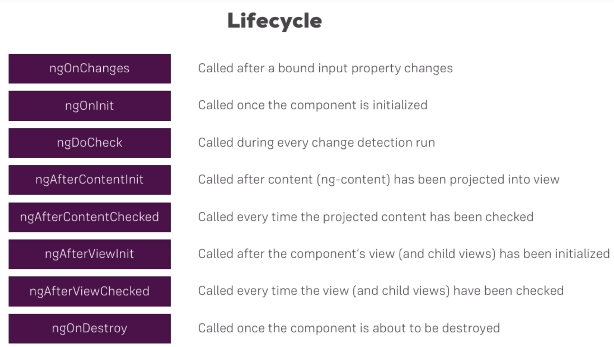

## Component的溝通


這是 Udemy 課程上某段程式碼執行後的結果，最一開始程式碼全寫在 AppComponent 中，再來要切分 Component，可以先自行看看畫面跟程式碼，看怎麼拆 Component，下面是課程中的拆法 :

``` html
<div class="container">
  <div class="row">
    <div class="col-xs-12">
      <p>Add new Servers or blueprints!</p>
      <label>Server Name</label>
      <input type="text" class="form-control" [(ngModel)]="newServerName">
      <label>Server Content</label>
      <input type="text" class="form-control" [(ngModel)]="newServerContent">
      <br>
      <button
        class="btn btn-primary"
        (click)="onAddServer()">Add Server</button>
      <button
        class="btn btn-primary"
        (click)="onAddBlueprint()">Add Server Blueprint</button>
    </div>
  </div>
  <hr>
  <div class="row">
    <div class="col-xs-12">
      <div
        class="panel panel-default"
        *ngFor="let element of serverElements">
        <div class="panel-heading">{{ element.name }}</div>
        <div class="panel-body">
          <p>
            <strong *ngIf="element.type === 'server'" style="color: red">{{ element.content }}</strong>
            <em *ngIf="element.type === 'blueprint'">{{ element.content }}</em>
          </p>
        </div>
      </div>
    </div>
  </div>
</div>
```

``` TypeScript
@Component({
  selector: 'app-root',
  templateUrl: './app.component.html',
  styleUrls: ['./app.component.css']
})
export class AppComponent {
  serverElements = [];
  newServerName = '';
  newServerContent = '';

  onAddServer() {
    this.serverElements.push({
      type: 'server',
      name: this.newServerName,
      content: this.newServerContent
    });
  }

  onAddBlueprint() {
    this.serverElements.push({
      type: 'blueprint',
      name: this.newServerName,
      content: this.newServerContent
    });
  }
}
```

在課程中將其拆成兩塊，分別執行指令 `ng g c cockpit`、`ng g c server-element`，產出兩個 Component，並把 AppComponent 的內容分別拆分進去 :

```
|--app
    |--app.component.html // 更動
    |--app.component.ts // 更動    
```

``` html
<div class="container">
  <app-cockpit></app-cockpit>
  <hr>
  <div class="row">
    <div class="col-xs-12">
      <app-server-element
        *ngFor="let serverElement of serverElements"></app-server-element>
    </div>
  </div>
</div>
```

``` TypeScript
export class AppComponent {
  serverElements = [];
}
```

```
|--cockpit
    |--cockpit.component.html // 更動
    |--cockpit.component.ts // 更動    
```

``` html
<div class="row">
  <div class="col-xs-12">
    <p>Add new Servers or blueprints!</p>
    <label>Server Name</label>
    <input type="text" class="form-control" [(ngModel)]="newServerName">
    <label>Server Content</label>
    <input type="text" class="form-control" [(ngModel)]="newServerContent">
    <br>
    <button
      class="btn btn-primary"
      (click)="onAddServer()">Add Server</button>
    <button
      class="btn btn-primary"
      (click)="onAddBlueprint()">Add Server Blueprint</button>
  </div>
</div>
```

``` TypeScript
export class CockpitComponent implements OnInit {
  newServerName = '';
  newServerContent = '';

  constructor() { }

  ngOnInit() {
  }

  onAddServer() {
    // this.serverElements.push({
    //   type: 'server',
    //   name: this.newServerName,
    //   content: this.newServerContent
    // });
  }

  onAddBlueprint() {
    // this.serverElements.push({
    //   type: 'blueprint',
    //   name: this.newServerName,
    //   content: this.newServerContent
    // });
  }
}
```

```
|--server-element
    |--server-element.component.html // 更動
    |--server-element.component.ts // 更動    
```

``` html
<div
  class="panel panel-default">
  <div class="panel-heading">{{ element.name }}</div>
  <div class="panel-body">
    <p>
      <strong *ngIf="element.type === 'server'" style="color: red">{{ element.content }}</strong>
      <em *ngIf="element.type === 'blueprint'">{{ element.content }}</em>
    </p>
  </div>
</div>
```

``` TypeScript
@Component({
  selector: 'app-server-element',
  templateUrl: './server-element.component.html',
  styleUrls: ['./server-element.component.css']
})
export class ServerElementComponent implements OnInit {

  constructor() { }

  ngOnInit() {
  }

}
```

拆成這樣後應該會有些問題在，因為會不清楚資料應該放在哪個 Component，不過後面的章節會再回來看，先來看從另一個角度切入 Component。

### 由另一個角度切入 Property Binding & Event Binding


這是從 Udemy 截下來的圖片，所想表達的是種類比，寫前端最熟悉不過的就是對 html Element 做操作，利用 html 的屬性告訴 Element 希望它呈現的樣式，利用 html 的 Event 反過來告訴我們有使用者在對 Element 做操作，這是單一 html Element 的概念。然而如果由比較抽象的角度來看，Component 也可以用這樣的想法去看待，畢竟 Component 就像是自行客製的 html Element，在 Angular 中是使用 `@Input`、`@Output` 來進行這樣的配置。

### `@Input`

剛切完 Component 有兩段地方有問題，第一個是 `cockpit.component.ts` 裡面的 method，它需要用到的 `serverElements` 陣列故意把它放在 AppComponent，之後會用其他方法來拿到，因此這段先把它註解起來，晚點再來看。另一個地方是 `server-element.component.html`，這裡面本來要使用 `*ngFor` 迭代出來的東西，也因為放在 AppComponent 而取不到，先從這邊下手 :

```
|--app
    |--app.component.html // 更動
    |--server-element
        |--server-element.component.ts // 更動   
```

``` html
<div class="container">
  <app-cockpit></app-cockpit>
  <hr>
  <div class="row">
    <div class="col-xs-12">
      <app-server-element
        *ngFor="let serverElement of serverElements"
        [element]="serverElement"></app-server-element>
    </div>
  </div>
</div>
```

``` TypeScript
export class ServerElementComponent implements OnInit {
  @Input()element: {type: string, name: string, content: string};

  constructor() { }

  ngOnInit() {
  }

}
```

在 `<app-server-element>` 加上一個 Property Binding 的語法，藉此把 `*ngFor` 中的 `serverElement` 綁定到 `ServerElementComponent` 內的 `element`，而 `ServerElementComponent` 內的 element 除了定義它的物件型別外，前面還加上 `@Input` 代表值是從外部帶進來的。如果希望更改此 Component 的 Property 名稱，可以在 `@Input` 中的小括號加上別名。像是 : 

`@Input(svcElement)` -> `<app-server-element [svcElement]="serverElement"></app-server-element>`。

### `@Output`

前面碰到的問題在這邊要用 `@Output` 來解決 :

``` 
|--app
    |--app.component.html // 更動
    |--app.component.ts // 更動
    |--cockpit
        |--cockpit.component.ts // 更動   
```
 
``` html
<div class="container">
  <app-cockpit
    (serverCreated)="onServerAdded($event)"
    (blueprintCreated)="onBlueprintAdded($event)"></app-cockpit>
  <hr>
  <div class="row">
    <div class="col-xs-12">
      <app-server-element
        *ngFor="let serverElement of serverElements"
        [element]="serverElement"></app-server-element>
    </div>
  </div>
</div>
```

``` TypeScript
export class AppComponent {
  serverElements = [{type: 'server', name: 'TestServer', content: 'Just a test!'}];

  onServerAdded(serverData: {serverName: string, serverContent: string}) {
    this.serverElements.push({
      type: 'server',
      name: serverData.serverName,
      content: serverData.serverContent
    });
  }

  onBlueprintAdded(blueprintData: {serverName: string, serverContent: string}) {
    this.serverElements.push({
      type: 'blueprint',
      name: blueprintData.serverName,
      content: blueprintData.serverContent
    });
  }
}
```

``` TypeScript
export class CockpitComponent implements OnInit {
  @Output() serverCreated = new EventEmitter<{serverName: string, serverContent: string}>();
  @Output() blueprintCreated = new EventEmitter<{serverName: string, serverContent: string}>();
  newServerName = '';
  newServerContent = '';

  constructor() { }

  ngOnInit() {
  }

  onAddServer() {
    this.serverCreated.emit({
      serverName: this.newServerName,
      serverContent: this.newServerContent
    });
  }

  onAddBlueprint() {
    this.blueprintCreated.emit({
      serverName: this.newServerName,
      serverContent: this.newServerContent
    });
  }
}
```

先看到 AppComponent 的 Template，主要的變動在於這段 `<app-cockpit (serverCreated)="onServerAdded($event)" (blueprintCreated)="onBlueprintAdded($event)"></app-cockpit>`，`onServerAdded($event)` 跟 `onBlueprintAdded($event)` 是定義在 TypeScript 中的 method，左邊的 Event Binding 則是定義在 `CockpitComponent` 內部的東西，而 AppComponent 的 TypeScript 中就單純地把 `onServerAdded`、`onBlueprintAdded` 給定義好就可以，並沒有用到新的東西。

接著看到 `CockpitComponent`，重點在於變數的宣告型別 `EventEmitter` 及 `@Output`，`EventEmitter` 是事件發射器，只要搭配 `@Output` 跟觸發它的 `emit()` 方法，外部的 Component 會接到 `emit(..)` 出來的東西。以這邊的例子來說當按下按鈕後，會發生 `emit()` 並把值給拋出去，注意 `@Output` 的物件名稱，其實跟外部 AppComponent 使用 `<app-cockpit>` 的 Event Binding 名稱一樣，也就完成客製化 Component 事件。另外 `@Output` 中的 `()` 其實跟 `@Input` 的作用相同，可更改對於外部 Component 所看到的事件名稱。

### ViewEncapsulation

做好上面的範例後回頭看幾個東西，首先是 `app.component.css`，前面提過它是根元件，也許會認為它的 css Style 會影響到底下的 Component，然而實際上不是如此 :

``` css
p {
  color: blue;
}
```

底下的 `server.element.html` 內部的 `<p>` 並沒有被改變成藍色，原因在於 Angular 幫忙做了封裝，雖然在 `server.element.html` 內部的元素都沒有添加任何屬性，然而用開發人員工具去檢視它，會發現每個 Component 中的 html Element 都被額外添加一個 Angular 的屬性 :


這是一件好事情，如果純粹用 JavaScript、html、css 三個文檔所組成的網頁，很常會有擔心 style 互相影響的問題，Angular 讓所有 Component 產生出來的 html Element 都會有特有的屬性，讓它們的 style 不會有交互影響。這樣的設定是可變動的，只要在 `@Component` 上增加新的屬性 :

``` TypeScript
@Component({
  selector: 'app-server-element',
  templateUrl: './server-element.component.html',
  styleUrls: ['./server-element.component.css'],
  encapsulation: ViewEncapsulation.Emulated //None、ShadowDom
})
```

`encapsulation` 可以設定要不要具有這種特性，`ViewEncapsulation.Emulated` 是原先的預設值、 `ViewEncapsulation.None` 是不替 Component 添加額外的屬性、`ViewEncapsulation.Emulated` 則採用瀏覽器原生提供的 ShadowDom。

### Template Reference Variable

先前使用 `ngModel` 的雙向綁定將 Template 的 input 以及 TypeScript 的變數綁定在一起，除了這種方法外還有種作法是範本參考變數，它賦予畫面上的元素變數名稱，藉此可以把元素傳到 TypeScript 中，也可以在 Template 中的各個地方去使用 ( 如果有印象的話，`*ngIf` 的 else 有用過這個技巧 ) :

``` 
|--cockpit
    |--cockpit.component.ts // 更動   
    |--cockpit.component.html // 更動   
```

``` html
<div class="row">
  <div class="col-xs-12">
    <p>Add new Servers or blueprints!</p>
    <label>Server Name</label>
    <input type="text"
            class="form-control"
            #serverNameInput>
    <label>Server Content</label>
    <input type="text" class="form-control" [(ngModel)]="newServerContent">
    <br>
    <button
      class="btn btn-primary"
      (click)="onAddServer(serverNameInput)">Add Server</button>
    <button
      class="btn btn-primary"
      (click)="onAddBlueprint(serverNameInput)">Add Server Blueprint</button>
  </div>
</div>
```

``` TypeScript
export class CockpitComponent implements OnInit {
  @Output() serverCreated = new EventEmitter<{serverName: string, serverContent: string}>();
  @Output() blueprintCreated = new EventEmitter<{serverName: string, serverContent: string}>();
  newServerName = '';
  newServerContent = '';

  constructor() { }

  ngOnInit() {
  }

  onAddServer(serverNameInput: HTMLInputElement) {
    this.serverCreated.emit({
      serverName: serverNameInput.value,
      serverContent: this.newServerContent
    });
  }

  onAddBlueprint(serverNameInput: HTMLInputElement) {
    this.blueprintCreated.emit({
      serverName: serverNameInput.value,
      serverContent: this.newServerContent
    });
  }
}
```

可以在 Template 中看到其中一個 `<input>` 多了 `#serverNameInput`，並且把 `serverNameInput` 丟到 Event Binding 的 method 當作參數，在 TypeScript 中把參數宣告為 `HTMLInputElement`，並且將內部的 `value` 值給取出來。

### `@ViewChild`

除了利用事件傳入對於 DOM 元素的參考，另一種做法是 `@ViewChild`，它可以在 TypeScript 中直接指到 Template 的元素而不必依靠事件來傳入 :

``` 
|--cockpit
    |--cockpit.component.ts // 更動   
    |--cockpit.component.html // 更動   
```

``` html
<div class="row">
  <div class="col-xs-12">
    <p>Add new Servers or blueprints!</p>
    <label>Server Name</label>
    <input type="text"
            class="form-control"
            #serverNameInput>
    <label>Server Content</label>
    <input type="text"
            class="form-control"
            #serverContentInput>
    <br>
    <button
      class="btn btn-primary"
      (click)="onAddServer(serverNameInput)">Add Server</button>
    <button
      class="btn btn-primary"
      (click)="onAddBlueprint(serverNameInput)">Add Server Blueprint</button>
  </div>
</div>
```

``` TypeScript
export class CockpitComponent implements OnInit {
  @Output() serverCreated = new EventEmitter<{serverName: string, serverContent: string}>();
  @Output() blueprintCreated = new EventEmitter<{serverName: string, serverContent: string}>();
  @ViewChild('serverContentInput', {static: true}) serverContentInput: ElementRef;

  constructor() { }

  ngOnInit() {
  }

  onAddServer(serverNameInput: HTMLInputElement) {
    this.serverCreated.emit({
      serverName: serverNameInput.value,
      serverContent: this.serverContentInput.nativeElement.value
    });
  }

  onAddBlueprint(serverNameInput: HTMLInputElement) {
    this.blueprintCreated.emit({
      serverName: serverNameInput.value,
      serverContent: this.serverContentInput.nativeElement.value
    });
  }
}
```

在 Template 中加上範本參考變數，然後在 TypeScript 的變數前加上 `@ViewClild`，小括號內部要放入 `serverContentInput`( 範本參考變數 ) 以及 `{static: true}`，這樣可以直接觀察到 Template 中的元素，而除了指定 html Element 外，其實也可指定自定義的 Component ( 想像成跟自定義的 html Element 一樣 )。

### `<ng-content>`

下一個 Component 之間的互動則是使用 `<ng-content>` :

```
|--app
    |--app.component.html // 更動
    |--server-element
        |--server-element.component.html // 更動   
```

``` html
<div class="container">
  <app-cockpit
    (serverCreated)="onServerAdded($event)"
    (blueprintCreated)="onBlueprintAdded($event)"></app-cockpit>
  <hr>
  <div class="row">
    <div class="col-xs-12">
      <app-server-element
        *ngFor="let serverElement of serverElements"
        [element]="serverElement">
        <p>
          <strong *ngIf="serverElement.type === 'server'" style="color: red">{{ serverElement.content }}</strong>
          <em *ngIf="serverElement.type === 'blueprint'">{{ serverElement.content }}</em>
        </p>
      </app-server-element>
    </div>
  </div>
</div>
```

``` html
<div
        class="panel panel-default">
        <div class="panel-heading">{{ element.name }}</div>
        <div class="panel-body">
          <ng-content></ng-content>
        </div>
      </div>
```

把原本存在於 `server-element.component.html` 的部分 Template 移出，放到 `app.component.html` 中，並且把它放到 `<app-server-element>` 這個自行定義的 Element 之間，然後在子元素使用 `<ng-content>` 取代原本元素的位置，這樣就完成在父元素自行定義部份 Template 的部分。另外會發現 `<p>` 變成藍色的字體，原因在於將其定義在外部的 Component 後，style 就屬於外部 Component。

### 生命週期



這是從 Udemy 截下來的圖片，在下面會用程式展現這些 Angular Component 的生命週期，先以文字來解釋生命週期 :

* ngOnChanges : 當 `@Input` 屬性有所異動時觸發。
* ngOnInit : 當元件被初始化時觸發。
* ngDoCheck : 當 Angular 執行 check detection 時會觸發。
* ngAfterContentInit : 當 `<ng-content>` 投射進來時觸發。
* ngAfterContentChecked : 當 `<ng-content>` 投射進來後，Angular 執行對它的 check detection 時觸發。 
* ngAfterViewInit : 當整體畫面完成初始化時觸發。
* ngAfterViewChecked : 當整體畫面完成後，Angular 執行對它的 check detection 時觸發。
* ngOnDestroy : 當 Component 被回收時觸發。

```
|--app
    |--app.component.html // 更動
    |--app.component.ts // 更動
    |--server-element
        |--server-element.component.ts // 更動   
```

``` html
<div class="container">
  <app-cockpit
    (serverCreated)="onServerAdded($event)"
    (blueprintCreated)="onBlueprintAdded($event)"></app-cockpit>
  <hr>
  <div class="row">
    <div class="col-xs-12">
      <button class="btn btn-primary" (click)="onChangeFirst()">Change First Element</button>
      <button class="btn btn-danger" (click)="onDestroyFirst()">Destroy First Component</button>
      <app-server-element
        *ngFor="let serverElement of serverElements"
        [element]="serverElement">
        <p>
          <strong *ngIf="serverElement.type === 'server'" style="color: red">{{ serverElement.content }}</strong>
          <em *ngIf="serverElement.type === 'blueprint'">{{ serverElement.content }}</em>
        </p>
      </app-server-element>
    </div>
  </div>
</div>
```

``` TypeScript
export class AppComponent {
  serverElements = [{type: 'server', name: 'TestServer', content: 'Just a test!'}];

  onServerAdded(serverData: {serverName: string, serverContent: string}) {
    this.serverElements.push({
      type: 'server',
      name: serverData.serverName,
      content: serverData.serverContent
    });
  }

  onBlueprintAdded(blueprintData: {serverName: string, serverContent: string}) {
    this.serverElements.push({
      type: 'blueprint',
      name: blueprintData.serverName,
      content: blueprintData.serverContent
    });
  }

  onChangeFirst() {
    this.serverElements[0].name = 'Changed!';
  }

  onDestroyFirst() {
    this.serverElements.splice(0, 1);
  }
}
```

``` TypeScript
export class ServerElementComponent implements OnInit,
    OnChanges, DoCheck, AfterContentInit, AfterContentChecked, AfterViewInit, AfterViewChecked, OnDestroy {
  @Input()element: {type: string, name: string, content: string};

  constructor() {
    console.log('Constructor called!');
  }

  ngOnInit() {
    console.log('ngOnInit called!');
  }

  ngOnChanges(changes: SimpleChanges) {
    console.log(changes);
    console.log('ngOnChanges called!');
  }

  ngDoCheck() {
    console.log('ngDoCheck called!');
  }

  ngAfterContentInit() {
    console.log('ngAfterContentInit called!');
  }

  ngAfterContentChecked() {
    console.log('ngAfterContentChecked called!');
  }

  ngAfterViewInit() {
    console.log('ngAfterViewInit called!');
  }

  ngAfterViewChecked() {
    console.log('ngAfterViewChecked called!');
  }

  ngOnDestroy() {
    console.log('ngOnDestroy called!');
  }

}
```

上面的程式碼嘗試實作所有 Component 的生命週期，並在外部的 AppComponent 做一些可以更新資料的 method，觀察當觸發這些 method 後，是否有跟著觸發內部的生命週期 ( 個人認為比較常用的生命週期是這三個 : `ngOnInit`、`ngOnChanges`、`ngOnDestroy` )。

### @ContentChild

使用 `@ContentChild` 的方式跟 `@ViewChild` 其實相同，只是觀察的元素從 Component 自己的 Template，變成是外部 Component 傳進來的 `<ng-content>` :

```
|--app
    |--app.component.html // 更動
    |--server-element
        |--server-element.component.html // 更動   
```

``` html
<div class="container">
  <app-cockpit
    (serverCreated)="onServerAdded($event)"
    (blueprintCreated)="onBlueprintAdded($event)"></app-cockpit>
  <hr>
  <div class="row">
    <div class="col-xs-12">
      <button class="btn btn-primary" (click)="onChangeFirst()">Change First Element</button>
      <button class="btn btn-danger" (click)="onDestroyFirst()">Destroy First Component</button>
      <app-server-element
        *ngFor="let serverElement of serverElements"
        [element]="serverElement">
        <p #contentParagraph>
          <strong *ngIf="serverElement.type === 'server'" style="color: red">{{ serverElement.content }}</strong>
          <em *ngIf="serverElement.type === 'blueprint'">{{ serverElement.content }}</em>
        </p>
      </app-server-element>
    </div>
  </div>
</div>
```

``` TypeScript
export class ServerElementComponent implements OnInit,
    OnChanges, DoCheck, AfterContentInit, AfterContentChecked, AfterViewInit, AfterViewChecked, OnDestroy {
  @Input()element: {type: string, name: string, content: string};
  @ContentChild('contentParagraph', {static: true}) paragraph: ElementRef;

  constructor() {
    console.log('Constructor called!');
  }

  ngOnInit() {
    console.log('ngOnInit called!');
  }

  ngOnChanges(changes: SimpleChanges) {
    console.log(changes);
    console.log('ngOnChanges called!');
  }

  ngDoCheck() {
    console.log('ngDoCheck called!');
  }

  ngAfterContentInit() {
    console.log(this.paragraph.nativeElement.textContent);
    console.log('ngAfterContentInit called!');
  }

  ngAfterContentChecked() {
    console.log('ngAfterContentChecked called!');
  }

  ngAfterViewInit() {
    console.log('ngAfterViewInit called!');
  }

  ngAfterViewChecked() {
    console.log('ngAfterViewChecked called!');
  }

  ngOnDestroy() {
    console.log('ngOnDestroy called!');
  }

}
```

### 總結

* `@Input()`
* `@Output()`
* Template Reference Variable
* `@ViewChild()`
* `<ng-content>`
* `@ContentChild()`
* ViewEncapsulation
* Component Lifecycle
